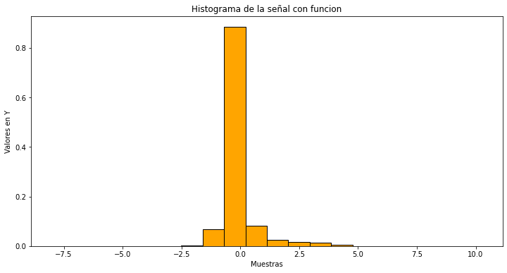
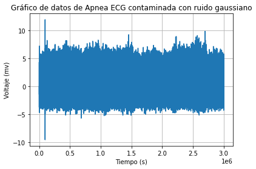
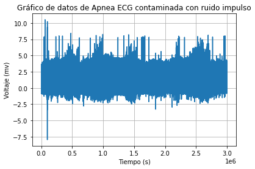

# Laboratorio #1 - Análisis Estadístico de la Señal

## Tabla de Contenidos
1. [Descripción de la señal fisiológica](#descripción)
2. [Descripción de la relación señal ruido en este proyecto](#descripción de la relación señal ruido en este proyecto)
3. [Instalaciones previas](#instalación)
4. [Instructivo y entendimiento del código](#instructivo)
5. [Resultados](#resultados)


## Descripción de la señal fisiológica

Como objeto  de análisis estadístico de señales en este caso se usará una señal de tipo fisiológico, específicamente una señal de ECG en apnea del sueño, la cual por la naturaleza del electrocardiograma estará en términos de mv en función del tiempo, el análisis de esta señal cobra importancia pues se pueden detectar de forma temprana insuficiencias cardíacas izquierdas. La obtención de dicho recurso fue a través de  las bases de datos que ofrece PhysioNet donde se pueden encontrar diversas señales biomedicas, dentro del record a08 de “Apnea ECG Database” se descargaron los tipos de archivo .dat y .hea para poder realizar el análisis correspiente de forma óptima y se procedió a calcular lo siguiente: Media, Desviación estándar, coeficiente de variación, Histograma, Función de probabilidad y contaminación con distintos tipos de ruido para analizar el SNR. Como se muestra a continuación.

## Descripción de la relación señal-ruido en este proyecto:

SNR: 

La proporción de la relación señal-ruido cuenta con unidades en dB y brinda características importantes que derivan de su naturaleza matemática como: De ser negativo indica mayor presencia de ruido que de señal de interés y de ser positivo indica a su vez un resultado menos contaminado. 

Esta relación se calcula de la siguiente manera 

10 log10 (Potencia de la señal / Potencia del ruido)

Por las propiedades del log10 se interpreta que una vez que la división da mayor a 1 la SNR será positiva y de lo contrario será negativa

Para esta práctica de aprendizaje se tienen 3 tipos de ruidos (gaussiano, Iimpulso y artefacto) para cada ruido se configuraron distintos valores de amplitudes o repetición en las muestras con el fin de obtener ambos resultados e interpretarlos, de la siguiente forma: 

* Gaussiano: 

         1. -2.61 (En este caso hay mayor contaminación)
         2. 11.48 (En este caso hay mayor señal de interés)

         Para este tipo de ruido se manipularon a conveniencia las amplitudes. 

Para los dos tipos de ruido restantes se manipularon a conveniencia la cantidad de repeticiones en la muestra pues al variar la amplitud no había mayor cambio:

* Impulso:

         1. 29.33 (En este caso hay mayor señal de interés)
         2. -8.62 (En este caso hay mayor contaminación)

* Artefacto 

         1. 10.65 (En este caso hay mayor señal de interés)
         2. -9.60 (En este caso hay mayor contaminación)


## Instalaciones previas:

1. Clona este repositorio en tu máquina local:

   ```bash
   git clone https://github.com/michelina20/Analisis_Estadistico_Apnea_ECG.git

2. Instala estas tres librerias con el fin de importar la señal fisiológica, ejecutar funciones estadísticas y gráficar lo necesario
   pip install wfdb matplotlib numpy


## Instructivo:

El paso a paso se encuentra línea a línea dentro del código

## resultados:

El histograma se grafico de la siguiente forma:
```python
#Importar paquete wfdb para leer "records" de physionet
import wfdb
import matplotlib.pyplot as plt 
import numpy as np

#SEÑAL FISIOLÓGICA: BASE DE DATOS DE APNEA - ECG (archivos .dat y .hea)

signal=wfdb.rdrecord('a08')
#Obtener valores de Y de la señal 
valores=signal.p_signal[:,0]
print(valores)
plt.plot(valores)
plt.title('Gráfico de datos de Apnea ECG record 8')
plt.xlabel('Tiempo (s)')
plt.ylabel('Voltaje (mv)')
plt.grid(True)


#Crear el histograma
plt.figure(figsize=(12, 6))
plt.hist(valores, bins=20, color='orange', edgecolor='black', density=True)
plt.xlabel('Muestras')
plt.ylabel('Valores en Y')
plt.title('Histograma de la señal con funcion')
plt.show()

```

#


La señal contaminada con ruido Gaussiano en el primer caso de acuerdo a lo descrito es:

```python
mean = 0       # Media del ruido (por defecto 0)
desviacion_estandar_ruido = 1    # Desviación estándar del ruido (por defecto 1)
# Genera ruido gaussiano 1
ruido = np.random.normal(mean, desviacion_estandar_ruido, valores.shape)

suma_señal_contaminada=valores+ruido
print(suma_señal_contaminada)
plt.plot(suma_señal_contaminada)
plt.title('Gráfico de datos de Apnea ECG contaminada con ruido gaussiano')
plt.xlabel('Tiempo (s)')
plt.ylabel('Voltaje (mv)')
plt.grid(True)

```

#

La señal contaminada con ruido Gaussiano en el segundo caso de acuerdo a lo descrito es:

```python
amplitud_deseada = 1  # Amplitud máxima específica que deseas
amplitud_original_ruido = np.max(np.abs(ruido))
scaled_ruido = (ruido /amplitud_original_ruido) * amplitud_deseada
nueva_amplitud_ruido = np.max(np.abs(scaled_ruido))

suma_señal_contaminada2=valores+scaled_ruido
print(suma_señal_contaminada2)
plt.plot(suma_señal_contaminada2)
plt.title('Gráfico de datos de Apnea ECG contaminada con ruido gaussiano')
plt.xlabel('Tiempo (s)')
plt.ylabel('Voltaje (mv)')
plt.grid(True)


```

#

La señal contaminada con ruido impulso en el primer caso de acuerdo a lo descrito es:

```python
ruido_impulso = np.zeros(len(valores))

n_impulses = int(len(valores) * 0.00001)

# Seleccionar posiciones aleatorias para los impulsos
impulse_positions = np.random.choice(len(valores), n_impulses, replace=False)

# Establecer los impulsos en la señal
ruido_impulso[impulse_positions] = 8 # Puedes ajustar el valor del impulso según sea necesario


señal_contaminada_impulso=valores+ruido_impulso
print(señal_contaminada_impulso)
plt.plot(señal_contaminada_impulso)
plt.title('Gráfico de datos de Apnea ECG contaminada con ruido impulso')
plt.xlabel('Tiempo (s)')
plt.ylabel('Voltaje (mv)')
plt.grid(True)

```
#
